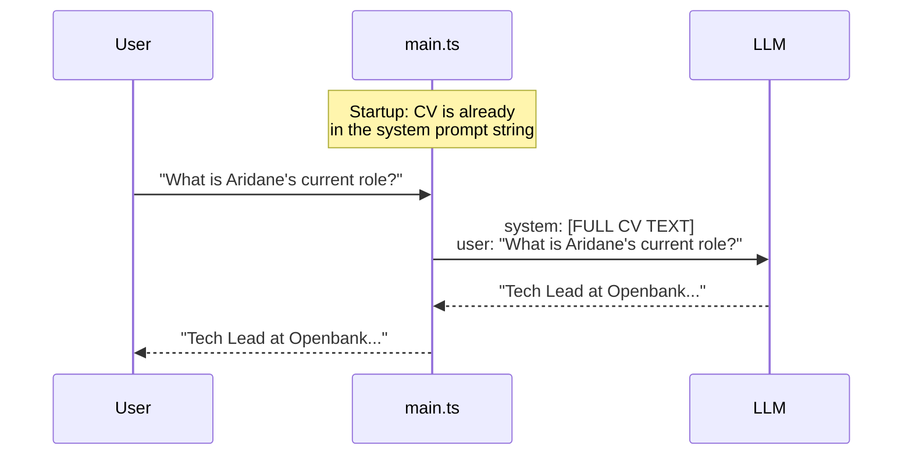

# RAG-01 — Static Context Injection

## What this demo shows

The simplest possible way to give an LLM knowledge about a specific topic: **paste the document directly into the system prompt**.

The CV is hardcoded in `src/prompt.ts`. The model receives the full text on every single API call, regardless of what the user asks.

## How it works



## File structure

```
src/
  prompt.ts     ← CV lives here, as a plain string
  setup.ts      ← builds the provider with that prompt
  main.ts       ← REPL loop
  internal/
    provider/   ← Ollama adapter (OpenAI-compatible)
    api/        ← shared message types
    ui/         ← terminal output helpers
```

## The core idea

```
System prompt = instructions + entire CV
```

Every call to the LLM includes the whole CV. The model reads it fresh each time and extracts whatever is relevant to the question.

## Why this works — and when it breaks

| | Works well | Breaks |
|---|---|---|
| **Document size** | Small (fits in context) | Large (exceeds token limit) |
| **Cost** | Fine for demos | Expensive at scale (paying for the full CV on every turn) |
| **Freshness** | Instant — just edit the string | Requires a code deploy to update |
| **Precision** | The model sees everything | Model may hallucinate or mix unrelated sections |

## The problem this creates

Imagine the CV grows to 50 pages, or you have 1000 employees' CVs. You cannot fit them all in the prompt. You need a way to **retrieve only the relevant parts** before sending them to the model.

That is what RAG-02 solves.

## Running it

```bash
cp .env.example .env   # set OLLAMA_MODEL and OLLAMA_BASE_URL
npm run dev
```
