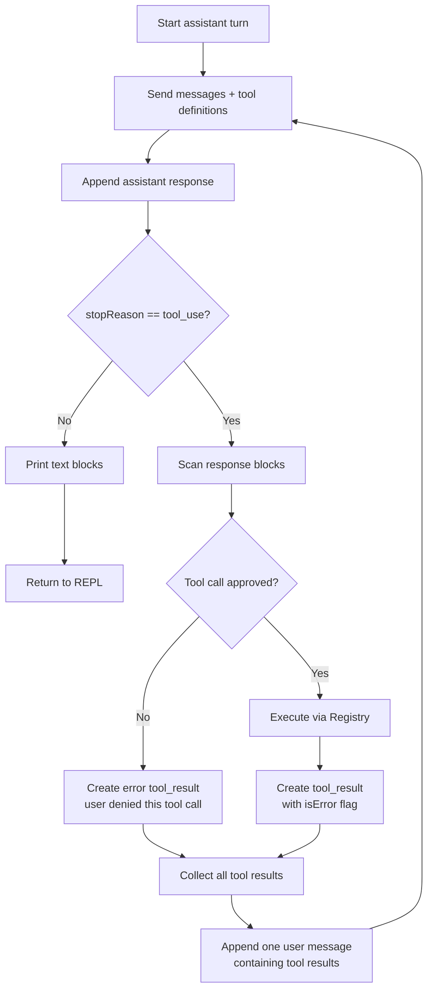

# Agent Loop Architecture

The core loop is `runAgentLoop()` in `src/internal/agent/loop.ts`.

It runs one assistant turn. A turn may include several provider round-trips if
the model asks to use tools.

## Inputs

```ts
runAgentLoop(provider, registry, messages, options);
```

- `provider`: any object implementing the `Provider` interface.
- `registry`: the tool registry used for definitions and execution.
- `messages`: the mutable conversation history.
- `options.requireConfirm`: whether to ask before executing each tool call.

`requireConfirm` defaults to `true`.

## Loop Steps

Each iteration does the following:



1. Calls `provider.send(messages, registry.definitions())`.
2. Appends the provider response as an assistant message.
3. If the response stop reason is not `tool_use`, prints text blocks and exits.
4. If tool calls are present, prints each tool call.
5. Prompts for confirmation when `requireConfirm` is enabled.
6. Executes approved tools through `registry.execute()`.
7. Converts approvals, denials, successes, and failures into `tool_result`
   blocks.
8. Appends all tool results from that model response as one user message.
9. Repeats.

## Conversation State

The loop mutates `messages` in place. This is intentional: `main.ts` owns one
array for the entire session, and each user turn extends it.

The assistant response is appended before executing tools. That order is
required because the next provider call must include the original `tool_use`
blocks and the corresponding `tool_result` blocks.

## Tool Result Grouping

If the model requests multiple tools in one assistant message, their results are
collected and appended as a single user message.

That keeps the harness history compact and preserves the idea that the tool
results answer one assistant turn.

## Permission Gate

Before a tool executes, the loop calls:

```ts
confirm(`approve ${block.toolName}?`);
```

If the user denies the call, no tool code runs. Instead, the loop appends:

```ts
{
  type: "tool_result",
  toolUseId: block.toolUseId,
  toolResult: "user denied this tool call",
  isError: true
}
```

This lets the model adapt instead of treating the denial as a successful tool
result.

## Error Handling

Provider errors are caught when they are instances of `ProviderError`. The loop
prints the provider error and returns to the REPL without ending the process.

Tool errors are not thrown. Each tool returns `{ result, isError }`, and the loop
passes that result back to the model.

Unexpected non-provider exceptions still bubble up to the top-level `main()`
catch handler.
