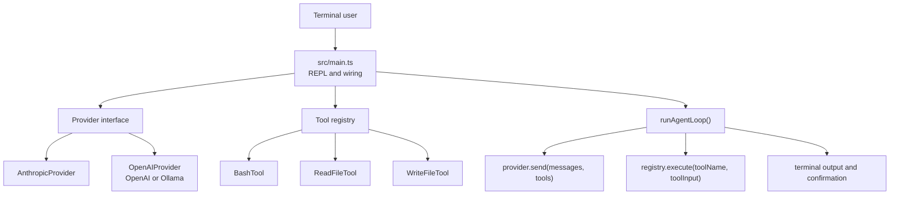
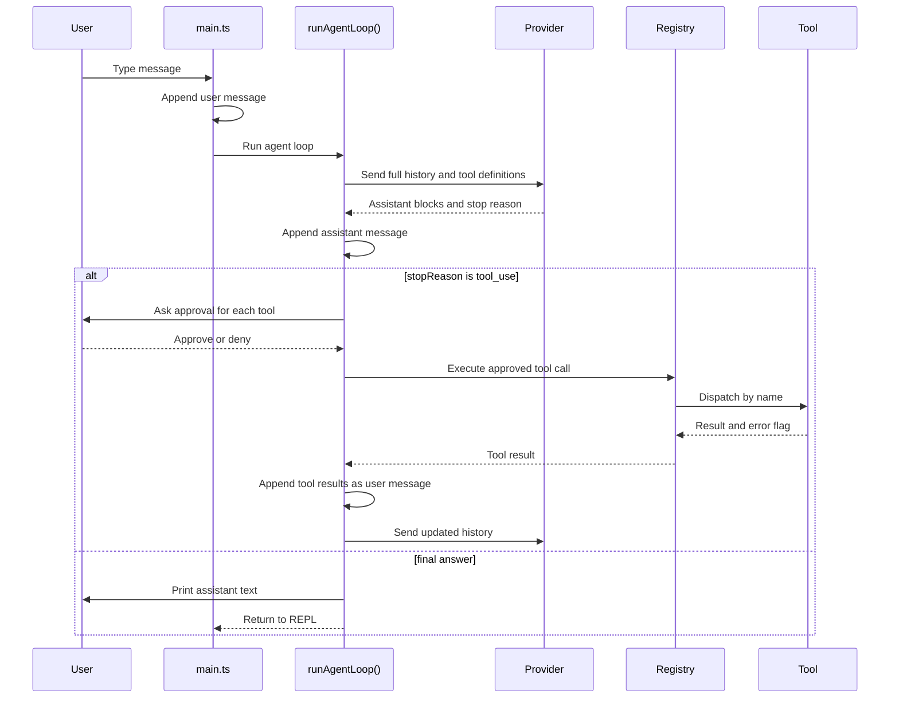

# Architecture

## High-Level Shape

The harness is split into small layers:

The core design goal is provider neutrality. The agent loop knows only about the
`Provider` interface and the shared message protocol. It does not import any LLM
SDK and does not know whether the backend is Anthropic, OpenAI, or Ollama.

## Process Startup

`src/main.ts` does the process-level setup:

1. Loads `.env` through `dotenv.config()`.
2. Builds a provider using `PROVIDER`.
3. Builds a `Registry` and registers the built-in tools.
4. Creates the session `messages` array.
5. Starts a Node `readline` REPL.

The system prompt is also defined in `main.ts`. It is passed into provider
constructors, because each provider has a different way to send system
instructions.

## Outer Loop vs Inner Loop

The harness has two loops:

- The outer loop is the REPL in `main.ts`. It reads one user line at a time.
- The inner loop is `runAgentLoop()` in `src/internal/agent/loop.ts`. It handles
  one assistant turn, including any tool calls needed before the model reaches a
  final answer.

This separation keeps terminal input concerns out of the agent logic.

## One Turn Flow

For a normal user message:

1. `main.ts` appends a user message to `messages`.
2. `main.ts` calls `runAgentLoop(provider, registry, messages, ...)`.
3. The loop sends the full history and available tool definitions to the
   provider.
4. The provider returns provider-neutral content blocks.
5. The loop appends the assistant response to `messages`.
6. If the response contains tool calls, the loop asks for approval, executes the
   tools, and appends tool results as one user message.
7. Steps 3-6 repeat while the provider reports `stopReason === "tool_use"`.
8. When the provider stops requesting tools, text blocks are printed and control
   returns to the REPL.

## Module Responsibilities

`src/internal/api/types.ts`

Defines the harness protocol shared by all layers. It has no dependency on any
SDK.

`src/internal/provider/*`

Adapts SDK-specific request and response formats to the harness protocol.

`src/internal/agent/loop.ts`

Coordinates provider calls, permission prompts, tool execution, conversation
state updates, and user-visible output for a single assistant turn.

`src/internal/tool/*`

Defines tool implementations and the registry that exposes tools to the model.

`src/internal/ui/*`

Contains terminal output and confirmation prompts.
