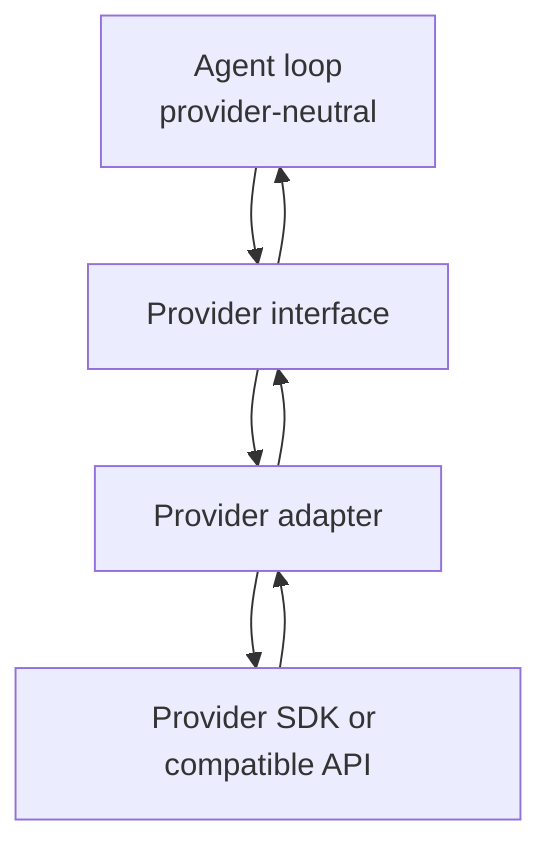
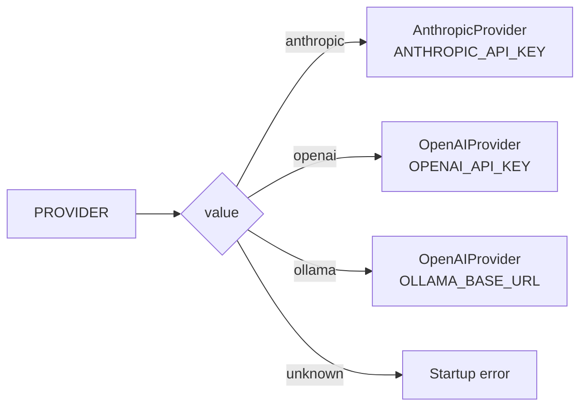

# Providers

Providers implement the interface in `src/internal/provider/index.ts`.

```ts
export interface Provider {
  send(messages: Message[], tools: ToolDef[]): Promise<LLMResponse>;
  model(): string;
  setModel(name: string): void;
}
```

The provider boundary keeps SDK details out of the agent loop.



## Provider Selection

`src/main.ts` reads `PROVIDER` from the environment:



- `anthropic`: creates `AnthropicProvider`.
- `openai`: creates `OpenAIProvider`.
- `ollama`: creates `OpenAIProvider` with an Ollama base URL.

Unknown provider names throw during startup.

## AnthropicProvider

File: `src/internal/provider/anthropic.ts`

Responsibilities:

- Imports `@anthropic-ai/sdk`.
- Requires `ANTHROPIC_API_KEY` by default.
- Stores the system prompt separately, because Anthropic sends it as a top-level
  `system` field.
- Converts harness messages to `Anthropic.MessageParam[]`.
- Converts harness tools to Anthropic tool definitions.
- Converts Anthropic content blocks back into harness blocks.
- Wraps Anthropic API errors in `ProviderError`.

The adapter ignores Anthropic content block types that are not part of this
harness protocol, such as thinking or server tool blocks.

## OpenAIProvider

File: `src/internal/provider/openai.ts`

Responsibilities:

- Imports `openai`.
- Supports both OpenAI and OpenAI-compatible APIs through `baseURL`.
- Sends the system prompt as the first chat message.
- Converts harness user, assistant, tool-use, and tool-result blocks into
  OpenAI chat messages.
- Converts OpenAI tool calls back into harness `tool_use` blocks.
- Maps OpenAI `finish_reason` values to harness stop reasons.
- Wraps OpenAI API errors in `ProviderError`.

OpenAI requires tool results as `role: "tool"` messages. The harness stores them
as user-role messages containing `tool_result` blocks, so this adapter performs
that translation.

OpenAI also requires assistant content to be `null` when a message contains tool
calls but no text. The adapter handles that detail.

## Ollama Mode

Ollama mode reuses `OpenAIProvider`:

```ts
new OpenAIProvider(
  SYSTEM_PROMPT,
  process.env.OLLAMA_MODEL ?? "llama3.2",
  "ollama",
  process.env.OLLAMA_BASE_URL ?? "http://localhost:11434/v1"
)
```

The API key is a placeholder because local Ollama does not require one, but the
OpenAI client expects a value.

## ProviderError

`ProviderError` carries:

- `message`
- optional `statusCode`
- `retryable`

The retryable flag is set for 429 and 5xx errors in the current adapters. The
core loop does not retry yet, but the flag is available for a future retry layer.
