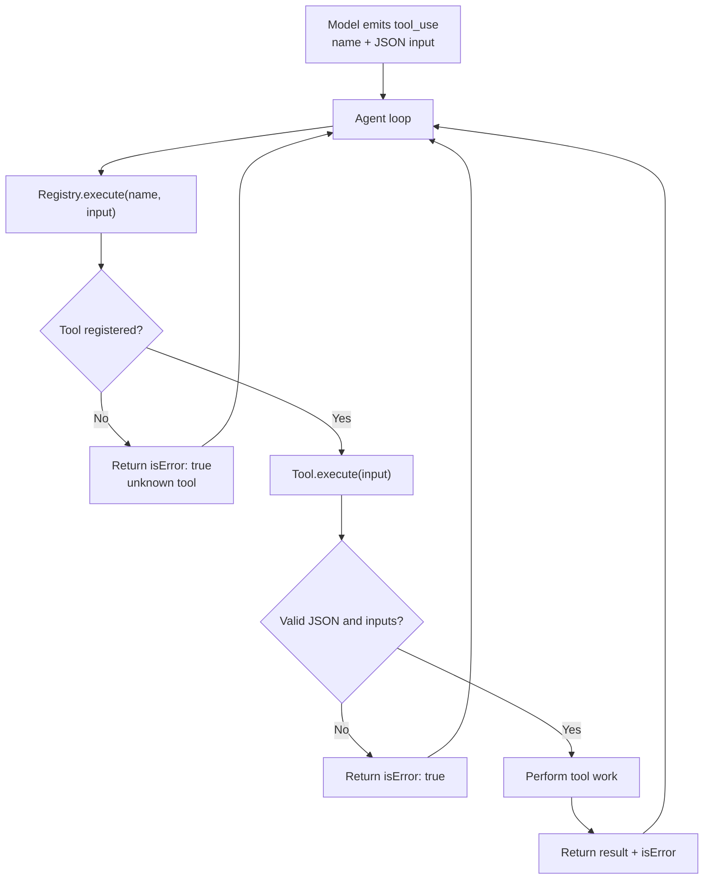

# Tools and Registry

Tools live in `src/internal/tool`. The registry exposes them to the model and
dispatches tool calls by name.

## Tool Interface

```ts
export interface Tool {
  definition(): ToolDef;
  execute(input: string): Promise<{ result: string; isError: boolean }>;
}
```

Important contract:

- `definition()` describes the tool for the model.
- `execute()` receives raw JSON string input from the provider.
- `execute()` should not throw for expected failures.
- Failures should return `isError: true`.

This lets the model see tool failures and try a corrected action.

## Registry

File: `src/internal/tool/registry.ts`

The registry stores tools in a `Map<string, Tool>` keyed by tool name.



Main methods:

- `register(tool)`: adds or replaces a tool by name.
- `definitions()`: returns sorted tool definitions for provider requests.
- `execute(name, input)`: finds and executes a tool.
- `subset(...names)`: creates a new registry with a selected tool set.
- `has(name)`: checks whether a tool is registered.

Definitions are sorted by name for stable provider input ordering.

Unknown tools return an error result instead of throwing:

```text
unknown tool: <name>
```

## Registered Tools

`src/main.ts` registers three tools:

```ts
registry.register(new BashTool());
registry.register(new ReadFileTool());
registry.register(new WriteFileTool());
```

TypeScript does not have Go-style `init()` registration, so registration is
explicit.

## BashTool

File: `src/internal/tool/bash.ts`

Tool name:

```text
bash
```

Schema:

```json
{
  "command": {
    "type": "string",
    "description": "The shell command to execute"
  }
}
```

Behavior:

- Parses input as JSON.
- Requires a non-empty `command`.
- Runs the command through Node `child_process.exec`.
- Uses a 30 second timeout.
- Uses a 1 MiB output buffer.
- Returns combined stdout and stderr.
- Marks non-zero exits, timeouts, invalid JSON, and empty commands as errors.

This tool has broad power. The runtime permission gate in the agent loop is the
main safety control before it executes.

## ReadFileTool

File: `src/internal/tool/read-file.ts`

Tool name:

```text
read_file
```

Schema:

```json
{
  "path": {
    "type": "string",
    "description": "The file path to read"
  }
}
```

Behavior:

- Parses input as JSON.
- Requires a non-empty `path`.
- Reads the file as UTF-8.
- Returns file content on success.
- Returns filesystem errors as `isError: true`.

Paths can be absolute or relative to the process working directory.

## WriteFileTool

File: `src/internal/tool/write-file.ts`

Tool name:

```text
write_file
```

Schema:

```json
{
  "path": {
    "type": "string",
    "description": "The file path to write to"
  },
  "content": {
    "type": "string",
    "description": "The text content to write"
  }
}
```

Behavior:

- Parses input as JSON.
- Requires a non-empty `path`.
- Creates parent directories recursively.
- Writes UTF-8 content.
- Overwrites existing files.
- Returns a short success message with the number of written characters.
- Returns filesystem errors as `isError: true`.

## Safety Model

This harness does not sandbox tools. Safety is provided by:

- Prompting the user before each tool call.
- Returning denials as error tool results.
- Keeping tool implementations simple and inspectable.

More advanced policy, sandboxing, allowlists, or per-tool permission levels would
belong in a later harness layer.
