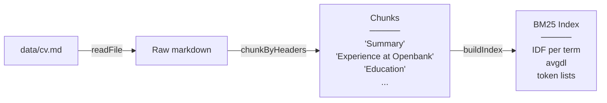
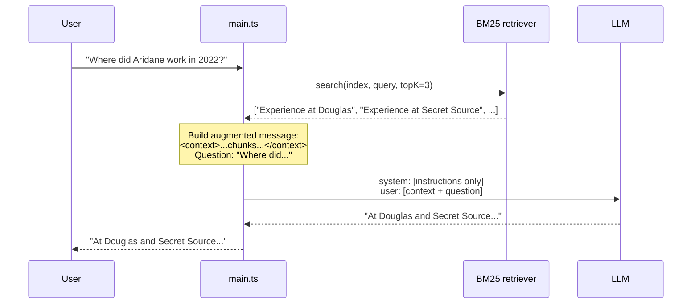

# RAG-02 — File Loading + BM25 Keyword Retrieval

## What this demo shows

The CV is no longer in the system prompt. It lives on disk as `data/cv.md`. Before every user question, the system **searches the document** for the most relevant sections and injects only those into the LLM context.

This is the "R" in RAG: **Retrieve** before you **Generate**.

## Two phases

### Phase 1 — Startup (index)



This runs once when the app starts. The BM25 index is held in memory.

### Phase 2 — Per query (retrieve + generate)



## How BM25 works

BM25 (Best Match 25) scores each chunk by how well its terms match the query terms. Two ideas behind it:

**Term frequency saturation** — mentioning "frontend" ten times in a chunk is not ten times better than mentioning it once. The score grows quickly at first and then plateaus.

**Length normalisation** — a long chunk that mentions a term once should not outrank a short chunk that also mentions it once. Longer chunks are penalised proportionally.

The formula for a single query term `t` in chunk `d`:

```
score(t, d) = IDF(t) × TF(t,d) × (k1 + 1)
              ─────────────────────────────────
              TF(t,d) + k1 × (1 - b + b × |d| / avgdl)

IDF(t) = log( (N - df(t) + 0.5) / (df(t) + 0.5) + 1 )
```

- `IDF(t)`: rare terms (appear in few chunks) get higher weight
- `TF(t,d)`: raw count of the term in the chunk
- `k1 = 1.5`: saturation constant
- `b = 0.75`: length normalisation strength
- `avgdl`: average chunk length across the whole index

The final score for a query is the sum of BM25 scores for each query term.

## File structure

```
data/
  cv.md             ← the document (not the prompt)
src/
  main.ts           ← startup: build index; per-query: retrieve → augment → send
  prompt.ts         ← instructions only, no CV content
  rag/
    loader.ts       ← fs.readFile(data/cv.md)
    chunker.ts      ← splits on "## " headers → Chunk[]
    retriever.ts    ← buildIndex() + search() with BM25
  internal/
    provider/       ← Anthropic + OpenAI/Ollama adapters
    api/            ← shared message types
    ui/             ← terminal output helpers
```

## What you see in the terminal

```
[rag] Retrieved 2 chunk(s): "Experience at Douglas", "Experience at Secret Source"
At Douglas (2022), Aridane developed the e-commerce frontend for 7 European countries...
```

The `[rag]` line shows exactly which chunks were retrieved. This transparency is intentional — it lets you debug retrieval quality and understand why the model gave a particular answer.

## Limitation: exact word matching

BM25 is fast and needs no GPU, but it only matches the exact words in the query. If you ask "Has he worked in e-commerce?" and the chunk says "online retail platform", BM25 scores zero — the terms don't overlap.

That is what RAG-03 solves with semantic embeddings.

## Running it

```bash
cp .env.example .env   # PROVIDER=ollama by default
npm run dev
```
