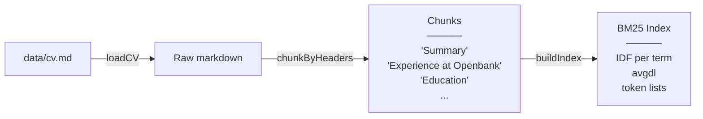
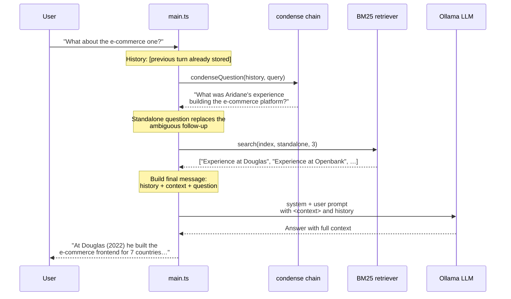

# RAG-03 — LangChain + BM25 + Condense Question

## Why LangChain

LangChain is a **framework** for building LLM-powered applications. It gives you:
- **Typed abstractions** for models, prompts, and messages instead of raw HTTP
- **Composable primitives** — chains, prompt templates, output parsers — that you mix without boilerplate
- **A standard interface** (`invoke`, `stream`, `batch`) so swapping Ollama for OpenAI or Anthropic is one line

For this project, LangChain makes the difference between "I'm writing glue code for one specific model" and "I'm building a pipeline that I can swap, inspect, and extend." Without LangChain, every prompt would be hand-assembled JSON, every history push would be a raw array, and the condense step would be another fetch call. With LangChain, the whole pipeline reads as a chain of typed objects.

## What this demo shows

RAG-03 keeps the same **BM25 keyword retrieval** from RAG-02 and adds one new piece: a **condense-question** step that rewrites conversational follow-ups into standalone queries before searching.

This is the "R" in RAG — **Retrieve** before you **Generate** — plus the "Q" in **Question rewriting** so multi-turn conversations work without leaking the full history into every BM25 search.

The difference from RAG-02: instead of using the raw user question as the BM25 query, it first runs an LLM call to **canonicalise** the question. "What about the e-commerce one?" becomes "What was Aridane's experience building the e-commerce platform at Douglas?" — which then matches the right BM25 chunks.

## How it works

### Phase 1 — Startup (index)



Runs once at startup. Same as RAG-02 — the BM25 index is built in memory from `data/cv.md`.

### Phase 2 — Per query (condense → retrieve → generate)



## What LangChain adds

Every LLM call in RAG-03 goes through **LangChain's `ChatPromptTemplate`** and **`ChatOllama`**, not raw HTTP to Ollama. Two concrete things:

| | Raw Ollama (RAG-02) | LangChain (RAG-03) |
|---|---|---|
| **Model call** | `fetch("http://localhost:11434/api/chat")` | `model.invoke(messages)` |
| **Prompt** | Hand-assembled JSON | `ChatPromptTemplate.fromMessages([…])` |
| **History** | Push/pop on a `BaseMessage[]` array | Same — but typed via `@langchain/core/messages` |
| **Condense** | N/A — raw question sent to BM25 | `condenseQuestion()` chain with `CONDENSE_PROMPT` |

The `condenseQuestion` step sends a small prompt (`CONDENSE_PROMPT` — ~6 lines) to the same Ollama model, asking it to rewrite the follow-up into a standalone question. On the first turn (empty history) the prompt is written to return the input unchanged, so no special-case branch is needed.

## File structure

```
data/
  cv.md             ← the document (same as RAG-02)
src/
  main.ts           ← startup: build index; per-query: condense → search → answer
  prompts.ts        ← ANSWER_PROMPT + CONDENSE_PROMPT (LangChain templates)
  setup.ts          ← buildChatModel() + buildRagIndex()
  chains/
    answer.ts       ← run ANSWER_PROMPT through the model
    condense.ts     ← run CONDENSE_PROMPT through the model (→ standalone)
  rag/
    loader.ts       ← fs.readFile(data/cv.md)
    chunker.ts      ← split on "## " headers → Chunk[]
    retriever.ts    ← buildIndex() + search() with BM25
  internal/
    ui/             ← terminal output helpers
```

## What you see in the terminal

```
╔══════════════════════════════════╗
║  RAG-03 — LangChain Intro        ║
╚══════════════════════════════════╝

Loading CV and building BM25 index…
Index ready. 15 chunks indexed.

> What about the e-commerce one?

[condense] Rewritten → standalone: "What was Aridane's experience building the e-commerce platform at Douglas?
[rag] Retrieved 2 chunk(s): "Experience at Douglas", "Experience at Secret Source"

At Douglas (2022), Aridane developed the e-commerce frontend for 7 European countries…
```

The `[condense]` line shows the rewritten question — this transparency lets you debug whether the condense step is working correctly.

## The problem this solves

RAG-02's BM25 only matches exact words. If the user asks a **follow-up** like "What about the e-commerce one?" after "Where did Aridane work in 2022?", the raw question has no overlap with any chunk. The condense step rewrites it using conversation history so BM25 can find the right chunks.

## Running it

```bash
cp .env.example .env   # OLLAMA_MODEL and OLLAMA_BASE_URL
npm run dev
```