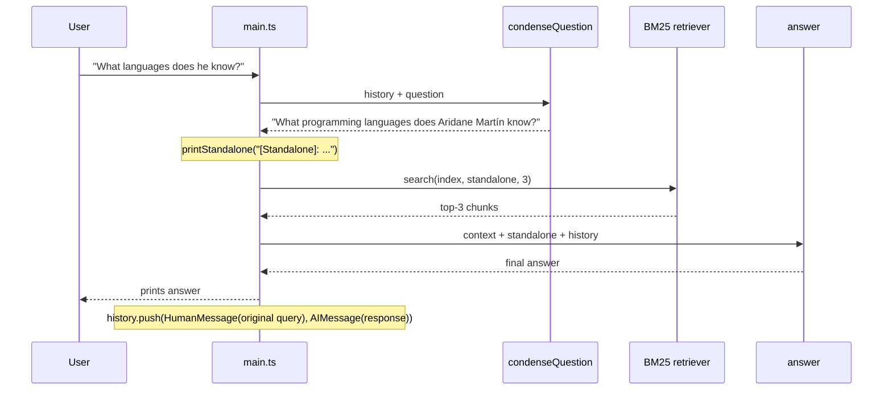

# RAG-03 — LangChain Intro

## What this demo shows

Two changes on top of RAG-02:

1. The hand-rolled `Provider` abstraction is replaced with LangChain.js (`ChatOllama` from `@langchain/ollama`).
2. Before retrieval, a **condense-question** step rewrites the follow-up question into a standalone question using the chat history. The rewrite is then used for both BM25 search and the final answer.

The standalone question is logged with a `[Standalone]:` tag so you can see exactly what the model used.

## Per-turn flow



History stores the **original** user message, not the standalone — the rewrite is a per-turn artifact only.

## What you see in the terminal

```
> Who is Aridane?
[Standalone]: Who is Aridane?
[rag] Retrieved 1 chunk(s): "Summary"
Aridane Martín is a Tech Lead and frontend developer based in Gran Canaria...

> What languages does he know?
[Standalone]: What programming languages does Aridane Martín know?
[rag] Retrieved 2 chunk(s): "Skills", "Summary"
He works primarily with TypeScript and JavaScript...
```

The follow-up "What languages does he know?" gets the implicit "he" resolved into "Aridane Martín" before BM25 ever runs — which means the retriever can actually match by name.

## File structure

```
data/
  cv.md              ← unchanged from RAG-02
src/
  main.ts            ← REPL + per-turn pipeline
  setup.ts           ← buildChatModel() + buildRagIndex()
  prompts.ts         ← CONDENSE_PROMPT, ANSWER_PROMPT (ChatPromptTemplate)
  chains/
    condense.ts      ← formats CONDENSE_PROMPT, calls model.invoke()
    answer.ts        ← formats ANSWER_PROMPT, calls model.invoke()
  rag/
    loader.ts        ← unchanged from RAG-02
    chunker.ts       ← unchanged from RAG-02
    retriever.ts     ← unchanged from RAG-02 (BM25)
  internal/ui/
    output.ts        ← + printStandalone()
```

## LangChain pieces in play

- `ChatOllama` from `@langchain/ollama` — the chat model.
- `ChatPromptTemplate.fromMessages([...])` from `@langchain/core/prompts` — template with variable interpolation.
- `MessagesPlaceholder("history")` — slot for a `BaseMessage[]` (chat history).
- `HumanMessage` / `AIMessage` / `BaseMessage` from `@langchain/core/messages` — typed messages.
- `prompt.formatMessages({ ... })` — turn the template into a concrete `BaseMessage[]`.
- `model.invoke(messages)` — single call, returns an `AIMessage` whose `.content` is the response text.

No LCEL pipes (`prompt.pipe(model).pipe(parser)`) on purpose — this is an intro and the plain async style reads top-to-bottom.

## Running it

```bash
cp .env.example .env
npm install
npm run dev
```

Requires a local Ollama with the model from `OLLAMA_MODEL` already pulled:

```bash
ollama pull llama3.2
```
