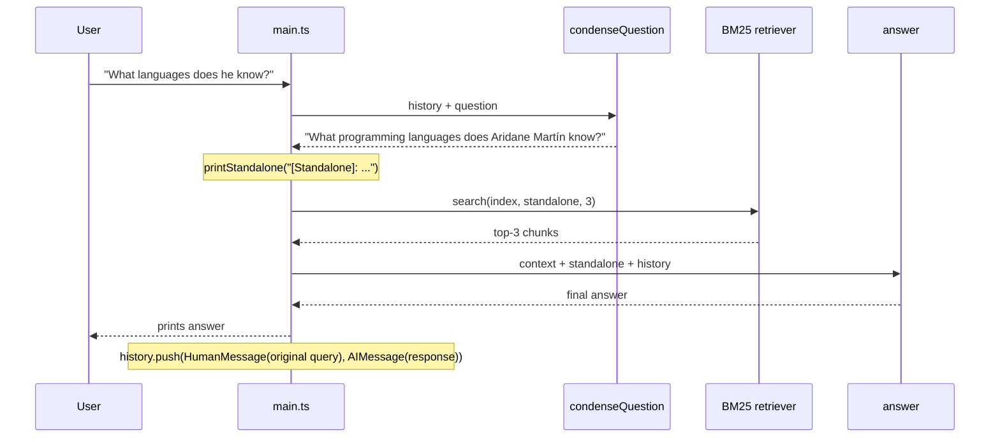

# RAG-03-langchain-intro Implementation Plan

> **For agentic workers:** REQUIRED SUB-SKILL: Use superpowers:subagent-driven-development (recommended) or superpowers:executing-plans to implement this plan task-by-task. Steps use checkbox (`- [ ]`) syntax for tracking.

**Goal:** Build a third RAG demo (`RAG-03-langchain-intro/`) that extends RAG-02 by replacing the hand-rolled `Provider` abstraction with LangChain.js (`ChatOllama`) and adds a condense-question step that logs `[Standalone]: <question>` and uses the rewrite for both BM25 retrieval and the final answer.

**Architecture:** Plain async functions (no LCEL pipes). Single provider: Ollama via `@langchain/ollama`. History is a `BaseMessage[]` passed by reference between the REPL and two small chain functions (`condenseQuestion`, `answer`). BM25 retrieval modules (`loader`, `chunker`, `retriever`) are copied verbatim from RAG-02.

**Tech Stack:** Node.js 20+, TypeScript (ES2022, NodeNext), `tsx`, `@langchain/core`, `@langchain/ollama`, `langchain` (umbrella).

**Spec:** `RAG-03-langchain-intro/docs/superpowers/specs/2026-06-14-rag-03-langchain-intro-design.md`

**Verification model:** This is a runnable demo, not a library. Per the spec's testing strategy, verification is `npm run typecheck` after each implementation task and a manual `npm run dev` smoke test at the end. No unit-test framework is added.

**All commands below assume the working directory is the workspace root:**
`/Users/aridanemartin/workspace/demos-herramientas-ai-aplicadas-al-desarrollo`

---

## File Structure

```
RAG-03-langchain-intro/
├── package.json
├── tsconfig.json
├── .gitignore
├── .env.example
├── data/
│   └── cv.md                        (copied verbatim from RAG-02)
├── docs/
│   ├── README.md
│   └── superpowers/
│       ├── specs/2026-06-14-rag-03-langchain-intro-design.md   (already exists)
│       └── plans/2026-06-14-rag-03-langchain-intro.md           (this file)
└── src/
    ├── main.ts                      REPL + per-turn orchestration
    ├── setup.ts                     buildChatModel() + buildRagIndex()
    ├── prompts.ts                   CONDENSE_PROMPT, ANSWER_PROMPT, ANSWER_SYSTEM_PROMPT
    ├── chains/
    │   ├── condense.ts              condenseQuestion(model, history, question)
    │   └── answer.ts                answer(model, context, standalone, history)
    ├── rag/
    │   ├── loader.ts                (copied verbatim from RAG-02)
    │   ├── chunker.ts               (copied verbatim from RAG-02)
    │   └── retriever.ts             (copied verbatim from RAG-02)
    └── internal/
        └── ui/
            └── output.ts            RAG-02's helpers + new printStandalone()
```

---

## Task 1: Scaffold project (package.json, tsconfig, env, gitignore)

**Files:**
- Create: `RAG-03-langchain-intro/package.json`
- Create: `RAG-03-langchain-intro/tsconfig.json`
- Create: `RAG-03-langchain-intro/.gitignore`
- Create: `RAG-03-langchain-intro/.env.example`

- [ ] **Step 1: Create `package.json`**

`RAG-03-langchain-intro/package.json`:

```json
{
  "name": "rag-03-langchain-intro",
  "version": "1.0.0",
  "description": "RAG demo 03: introduce LangChain.js with a condense-question step",
  "type": "module",
  "scripts": {
    "dev": "tsx src/main.ts",
    "typecheck": "tsc --noEmit"
  },
  "dependencies": {
    "@langchain/core": "^0.3.0",
    "@langchain/ollama": "^0.2.0",
    "langchain": "^0.3.0"
  },
  "devDependencies": {
    "@types/node": "^22.0.0",
    "tsx": "^4.19.0",
    "typescript": "^5.8.0"
  }
}
```

- [ ] **Step 2: Create `tsconfig.json`**

`RAG-03-langchain-intro/tsconfig.json` (identical to RAG-02):

```json
{
  "compilerOptions": {
    "target": "ES2022",
    "module": "NodeNext",
    "moduleResolution": "NodeNext",
    "outDir": "dist",
    "rootDir": "src",
    "strict": true,
    "noUnusedLocals": true,
    "noUnusedParameters": true,
    "esModuleInterop": true,
    "skipLibCheck": true,
    "resolveJsonModule": true
  },
  "include": ["src/**/*"]
}
```

- [ ] **Step 3: Create `.gitignore`**

`RAG-03-langchain-intro/.gitignore`:

```
node_modules/
dist/
.env
```

- [ ] **Step 4: Create `.env.example`**

`RAG-03-langchain-intro/.env.example`:

```
# Ollama (only provider supported in RAG-03)
OLLAMA_BASE_URL=http://localhost:11434
OLLAMA_MODEL=llama3.2
```

- [ ] **Step 5: Install dependencies**

Run:
```bash
cd RAG-03-langchain-intro && npm install && cd ..
```
Expected: an `npm install` summary, no errors. A `package-lock.json` and `node_modules/` directory appear in `RAG-03-langchain-intro/`.

- [ ] **Step 6: Commit**

```bash
git add RAG-03-langchain-intro/package.json \
        RAG-03-langchain-intro/package-lock.json \
        RAG-03-langchain-intro/tsconfig.json \
        RAG-03-langchain-intro/.gitignore \
        RAG-03-langchain-intro/.env.example
git commit -m "chore(rag-03): scaffold project with LangChain dependencies"
```

---

## Task 2: Copy data and RAG modules from RAG-02

**Files:**
- Create: `RAG-03-langchain-intro/data/cv.md`            (copy of RAG-02 file)
- Create: `RAG-03-langchain-intro/src/rag/loader.ts`     (copy of RAG-02 file)
- Create: `RAG-03-langchain-intro/src/rag/chunker.ts`    (copy of RAG-02 file)
- Create: `RAG-03-langchain-intro/src/rag/retriever.ts`  (copy of RAG-02 file)

These files are byte-identical to RAG-02. The retriever expects `data/cv.md` to sit two directories up from `src/rag/loader.ts` (`../../data/cv.md`), which matches the layout below.

- [ ] **Step 1: Copy the data directory**

```bash
mkdir -p RAG-03-langchain-intro/data
cp RAG-02-file-loading-and-kw-retrieval/data/cv.md RAG-03-langchain-intro/data/cv.md
```

- [ ] **Step 2: Copy the rag modules**

```bash
mkdir -p RAG-03-langchain-intro/src/rag
cp RAG-02-file-loading-and-kw-retrieval/src/rag/loader.ts    RAG-03-langchain-intro/src/rag/loader.ts
cp RAG-02-file-loading-and-kw-retrieval/src/rag/chunker.ts   RAG-03-langchain-intro/src/rag/chunker.ts
cp RAG-02-file-loading-and-kw-retrieval/src/rag/retriever.ts RAG-03-langchain-intro/src/rag/retriever.ts
```

- [ ] **Step 3: Verify typecheck still works once main.ts is missing**

Until `src/main.ts` exists, `tsc --noEmit` will still succeed because `include: ["src/**/*"]` only fails if a referenced module is missing. Confirm:

```bash
cd RAG-03-langchain-intro && npx tsc --noEmit && cd ..
```
Expected: no output (success).

- [ ] **Step 4: Commit**

```bash
git add RAG-03-langchain-intro/data RAG-03-langchain-intro/src/rag
git commit -m "chore(rag-03): copy CV data and BM25 retriever from RAG-02"
```

---

## Task 3: Add UI output helpers including printStandalone

**Files:**
- Create: `RAG-03-langchain-intro/src/internal/ui/output.ts`

This file is RAG-02's `output.ts` plus one extra helper `printStandalone()` that prints the standalone question with a yellow `[Standalone]` tag.

- [ ] **Step 1: Create `src/internal/ui/output.ts`**

`RAG-03-langchain-intro/src/internal/ui/output.ts`:

```typescript
export function printText(text: string): void {
  process.stdout.write(text + "\n");
}

export function printError(message: string): void {
  process.stderr.write(`\x1b[31m[error]\x1b[0m ${message}\n`);
}

export function printInfo(message: string): void {
  process.stdout.write(`\x1b[36m[info]\x1b[0m ${message}\n`);
}

export function printRag(message: string): void {
  process.stdout.write(`\x1b[35m[rag]\x1b[0m ${message}\n`);
}

export function printStandalone(question: string): void {
  process.stdout.write(`\x1b[33m[Standalone]\x1b[0m: ${question}\n`);
}

export function printPrompt(): void {
  process.stdout.write("\x1b[1m> \x1b[0m");
}
```

- [ ] **Step 2: Typecheck**

```bash
cd RAG-03-langchain-intro && npx tsc --noEmit && cd ..
```
Expected: no output (success).

- [ ] **Step 3: Commit**

```bash
git add RAG-03-langchain-intro/src/internal/ui/output.ts
git commit -m "feat(rag-03): add UI output helpers with printStandalone"
```

---

## Task 4: Write prompts module

**Files:**
- Create: `RAG-03-langchain-intro/src/prompts.ts`

Defines the system prompt copied from RAG-02, the LangChain `ChatPromptTemplate` for condensation, and the answer template that injects retrieved context.

- [ ] **Step 1: Create `src/prompts.ts`**

`RAG-03-langchain-intro/src/prompts.ts`:

```typescript
import {
  ChatPromptTemplate,
  MessagesPlaceholder,
} from "@langchain/core/prompts";

// The system prompt used for the final answer call.
// Same content as RAG-02's prompt.ts.
export const ANSWER_SYSTEM_PROMPT = `You are a virtual assistant that answers questions about Aridane Martín's professional profile.

Before each question you will receive relevant excerpts from his CV as context inside <context> tags. Answer using only the provided context. If the context does not contain enough information to answer, say so clearly.

Be concise. Answer in the same language the user uses.`;

// Rewrites a follow-up question into a standalone question using prior history.
// On the first turn (empty history) the model is instructed to return the
// question unchanged, so main.ts does not need a special-case branch.
export const CONDENSE_PROMPT = ChatPromptTemplate.fromMessages([
  [
    "system",
    `Given the conversation history below and a follow-up question, rewrite the follow-up so it can be understood without the history.

Rules:
- Reply with the rewritten question only — no explanations, no quotes.
- Use the same language as the follow-up question.
- If the question is already standalone, or if there is no prior history, return it unchanged.`,
  ],
  new MessagesPlaceholder("history"),
  ["human", "Follow-up question: {question}\nStandalone question:"],
]);

// Final answer template. Receives the BM25 context, the standalone question,
// and the conversation history for tone/continuity.
export const ANSWER_PROMPT = ChatPromptTemplate.fromMessages([
  ["system", ANSWER_SYSTEM_PROMPT],
  new MessagesPlaceholder("history"),
  ["human", "<context>\n{context}\n</context>\n\nQuestion: {standalone}"],
]);
```

- [ ] **Step 2: Typecheck**

```bash
cd RAG-03-langchain-intro && npx tsc --noEmit && cd ..
```
Expected: no output (success).

- [ ] **Step 3: Commit**

```bash
git add RAG-03-langchain-intro/src/prompts.ts
git commit -m "feat(rag-03): add LangChain prompt templates for condense and answer"
```

---

## Task 5: Write condense chain

**Files:**
- Create: `RAG-03-langchain-intro/src/chains/condense.ts`

`condenseQuestion()` formats the `CONDENSE_PROMPT` with history + question, calls `model.invoke()`, and returns the standalone text.

- [ ] **Step 1: Create `src/chains/condense.ts`**

`RAG-03-langchain-intro/src/chains/condense.ts`:

```typescript
import type { BaseMessage } from "@langchain/core/messages";
import type { ChatOllama } from "@langchain/ollama";
import { CONDENSE_PROMPT } from "../prompts.js";

// Rewrite a follow-up question into a standalone question using prior history.
// On first turn (empty history) the prompt is written to return the input
// unchanged, so this function still runs but produces the same string back.
export async function condenseQuestion(
  model: ChatOllama,
  history: BaseMessage[],
  question: string,
): Promise<string> {
  const messages = await CONDENSE_PROMPT.formatMessages({ history, question });
  const response = await model.invoke(messages);

  // ChatOllama returns AIMessage. `.content` is typed as
  // `string | MessageContentComplex[]`. In practice the chat model returns a
  // string for text-only responses, so we coerce defensively and trim.
  const text =
    typeof response.content === "string"
      ? response.content
      : String(response.content);

  return text.trim();
}
```

- [ ] **Step 2: Typecheck**

```bash
cd RAG-03-langchain-intro && npx tsc --noEmit && cd ..
```
Expected: no output (success).

- [ ] **Step 3: Commit**

```bash
git add RAG-03-langchain-intro/src/chains/condense.ts
git commit -m "feat(rag-03): add condenseQuestion chain"
```

---

## Task 6: Write answer chain

**Files:**
- Create: `RAG-03-langchain-intro/src/chains/answer.ts`

`answer()` formats the `ANSWER_PROMPT` with retrieved context + standalone + history, calls `model.invoke()`, and returns the response text.

- [ ] **Step 1: Create `src/chains/answer.ts`**

`RAG-03-langchain-intro/src/chains/answer.ts`:

```typescript
import type { BaseMessage } from "@langchain/core/messages";
import type { ChatOllama } from "@langchain/ollama";
import { ANSWER_PROMPT } from "../prompts.js";

// Generate the final answer given the retrieved context, the standalone
// question, and the chat history.
export async function answer(
  model: ChatOllama,
  context: string,
  standalone: string,
  history: BaseMessage[],
): Promise<string> {
  const messages = await ANSWER_PROMPT.formatMessages({
    history,
    context,
    standalone,
  });
  const response = await model.invoke(messages);

  const raw = response.content;
  const text =
    typeof raw === "string"
      ? raw
      : raw
          .map((part) => (typeof part === "string" ? part : "text" in part ? part.text : ""))
          .join("");

  return text.trim();
}
```

- [ ] **Step 2: Typecheck**

```bash
cd RAG-03-langchain-intro && npx tsc --noEmit && cd ..
```
Expected: no output (success).

- [ ] **Step 3: Commit**

```bash
git add RAG-03-langchain-intro/src/chains/answer.ts
git commit -m "feat(rag-03): add answer chain that injects retrieved context"
```

---

## Task 7: Write setup module

**Files:**
- Create: `RAG-03-langchain-intro/src/setup.ts`

Two builders: one for the LangChain chat model (Ollama only), one for the BM25 index (identical logic to RAG-02).

- [ ] **Step 1: Create `src/setup.ts`**

`RAG-03-langchain-intro/src/setup.ts`:

```typescript
// Wires up the two pieces that main.ts needs:
//   buildChatModel() — a LangChain ChatOllama instance configured via env vars
//   buildRagIndex()  — load → chunk → BM25 index (same as RAG-02)

import { ChatOllama } from "@langchain/ollama";
import { chunkByHeaders } from "./rag/chunker.js";
import { loadCV } from "./rag/loader.js";
import type { Index } from "./rag/retriever.js";
import { buildIndex } from "./rag/retriever.js";

export function buildChatModel(): ChatOllama {
  return new ChatOllama({
    model: process.env.OLLAMA_MODEL ?? "llama3.2",
    baseUrl: process.env.OLLAMA_BASE_URL ?? "http://localhost:11434",
    temperature: 0,
  });
}

export async function buildRagIndex(): Promise<Index> {
  const markdown = await loadCV();
  const chunks = chunkByHeaders(markdown);
  return buildIndex(chunks);
}
```

- [ ] **Step 2: Typecheck**

```bash
cd RAG-03-langchain-intro && npx tsc --noEmit && cd ..
```
Expected: no output (success).

- [ ] **Step 3: Commit**

```bash
git add RAG-03-langchain-intro/src/setup.ts
git commit -m "feat(rag-03): add setup helpers for ChatOllama and BM25 index"
```

---

## Task 8: Write main.ts (REPL with condense → retrieve → answer)

**Files:**
- Create: `RAG-03-langchain-intro/src/main.ts`

REPL loop. Per turn: condense → log `[Standalone]:` → BM25 search → answer → push original user message + AI message into history. `/exit` and `/clear` mirror RAG-02.

- [ ] **Step 1: Create `src/main.ts`**

`RAG-03-langchain-intro/src/main.ts`:

```typescript
// Entry point for RAG-03.
// Per-turn pipeline:
//   user query → condenseQuestion(history, query) → standalone
//              → printStandalone(standalone)
//              → BM25 search(index, standalone, 3)
//              → answer(model, context, standalone, history)
//              → history.push(HumanMessage(query), AIMessage(response))

import * as readline from "readline";
import { AIMessage, HumanMessage } from "@langchain/core/messages";
import type { BaseMessage } from "@langchain/core/messages";
import { answer } from "./chains/answer.js";
import { condenseQuestion } from "./chains/condense.js";
import {
  printError,
  printInfo,
  printPrompt,
  printRag,
  printStandalone,
  printText,
} from "./internal/ui/output.js";
import type { Index } from "./rag/retriever.js";
import { search } from "./rag/retriever.js";
import { buildChatModel, buildRagIndex } from "./setup.js";

async function main(): Promise<void> {
  printText("\x1b[1m\x1b[36m╔══════════════════════════════════╗\x1b[0m");
  printText("\x1b[1m\x1b[36m║  RAG-03 — LangChain Intro        ║\x1b[0m");
  printText("\x1b[1m\x1b[36m╚══════════════════════════════════╝\x1b[0m");

  // ── 1. Build the RAG index ─────────────────────────────────────────────────
  printInfo("Loading CV and building BM25 index…");
  const index: Index = await buildRagIndex();
  printInfo(`Index ready. ${index.chunks.length} chunks indexed.`);
  printText("");

  // ── 2. Build the LangChain ChatOllama model ────────────────────────────────
  const model = buildChatModel();
  printInfo(
    `Model: ${process.env.OLLAMA_MODEL ?? "llama3.2"} @ ${process.env.OLLAMA_BASE_URL ?? "http://localhost:11434"}`,
  );
  printInfo("Type your question. /clear to reset, /exit to quit.");
  printText("");

  const history: BaseMessage[] = [];

  const rl = readline.createInterface({
    input: process.stdin,
    output: process.stdout,
    terminal: !!process.stdout.isTTY,
  });

  printPrompt();

  for await (const line of rl) {
    const query = line.trim();

    if (!query) {
      printPrompt();
      continue;
    }

    if (query === "/exit" || query === "/quit") {
      printText("Goodbye.");
      break;
    }

    if (query === "/clear") {
      history.length = 0;
      printInfo("Conversation cleared.");
      printPrompt();
      continue;
    }

    try {
      // ── 3. Condense follow-up into a standalone question ────────────────────
      const standalone = await condenseQuestion(model, history, query);
      printStandalone(standalone);

      // ── 4. BM25 retrieval using the standalone question ─────────────────────
      const hits = search(index, standalone, 3);

      if (hits.length === 0) {
        printRag("No matching chunks found — sending question without context.");
      } else {
        printRag(
          `Retrieved ${hits.length} chunk(s): ${hits.map((c) => `"${c.title}"`).join(", ")}`,
        );
      }

      const context = hits
        .map((c) => `## ${c.title}\n${c.content}`)
        .join("\n\n---\n\n");

      // ── 5. Generate the final answer ────────────────────────────────────────
      const response = await answer(model, context, standalone, history);
      printText(response);

      // ── 6. Update history with the ORIGINAL user query and AI response ──────
      history.push(new HumanMessage(query));
      history.push(new AIMessage(response));
    } catch (err) {
      printError(err instanceof Error ? err.message : String(err));
    }

    printText("");
    printPrompt();
  }

  rl.close();
}

main().catch((err: unknown) => {
  printError((err as Error).message);
  process.exit(1);
});
```

- [ ] **Step 2: Typecheck**

```bash
cd RAG-03-langchain-intro && npx tsc --noEmit && cd ..
```
Expected: no output (success).

- [ ] **Step 3: Commit**

```bash
git add RAG-03-langchain-intro/src/main.ts
git commit -m "feat(rag-03): add REPL with condense → retrieve → answer pipeline"
```

---

## Task 9: Write docs/README.md

**Files:**
- Create: `RAG-03-langchain-intro/docs/README.md`

Walkthrough that mirrors RAG-02's docs style — what's new, the per-turn flow diagram, and how to run.

- [ ] **Step 1: Create `docs/README.md`**

`RAG-03-langchain-intro/docs/README.md`:

````markdown
# RAG-03 — LangChain Intro

## What this demo shows

Two changes on top of RAG-02:

1. The hand-rolled `Provider` abstraction is replaced with LangChain.js (`ChatOllama` from `@langchain/ollama`).
2. Before retrieval, a **condense-question** step rewrites the follow-up question into a standalone question using the chat history. The rewrite is then used for both BM25 search and the final answer.

The standalone question is logged with a `[Standalone]:` tag so you can see exactly what the model used.

## Per-turn flow



History stores the **original** user message, not the standalone — the rewrite is a per-turn artifact only.

## What you see in the terminal

```
> Who is Aridane?
[Standalone]: Who is Aridane?
[rag] Retrieved 1 chunk(s): "Summary"
Aridane Martín is a Tech Lead and frontend developer based in Gran Canaria...

> What languages does he know?
[Standalone]: What programming languages does Aridane Martín know?
[rag] Retrieved 2 chunk(s): "Skills", "Summary"
He works primarily with TypeScript and JavaScript...
```

The follow-up "What languages does he know?" gets the implicit "he" resolved into "Aridane Martín" before BM25 ever runs — which means the retriever can actually match by name.

## File structure

```
data/
  cv.md              ← unchanged from RAG-02
src/
  main.ts            ← REPL + per-turn pipeline
  setup.ts           ← buildChatModel() + buildRagIndex()
  prompts.ts         ← CONDENSE_PROMPT, ANSWER_PROMPT (ChatPromptTemplate)
  chains/
    condense.ts      ← formats CONDENSE_PROMPT, calls model.invoke()
    answer.ts        ← formats ANSWER_PROMPT, calls model.invoke()
  rag/
    loader.ts        ← unchanged from RAG-02
    chunker.ts       ← unchanged from RAG-02
    retriever.ts     ← unchanged from RAG-02 (BM25)
  internal/ui/
    output.ts        ← + printStandalone()
```

## LangChain pieces in play

- `ChatOllama` from `@langchain/ollama` — the chat model.
- `ChatPromptTemplate.fromMessages([...])` from `@langchain/core/prompts` — template with variable interpolation.
- `MessagesPlaceholder("history")` — slot for a `BaseMessage[]` (chat history).
- `HumanMessage` / `AIMessage` / `BaseMessage` from `@langchain/core/messages` — typed messages.
- `prompt.formatMessages({ ... })` — turn the template into a concrete `BaseMessage[]`.
- `model.invoke(messages)` — single call, returns an `AIMessage` whose `.content` is the response text.

No LCEL pipes (`prompt.pipe(model).pipe(parser)`) on purpose — this is an intro and the plain async style reads top-to-bottom.

## Running it

```bash
cp .env.example .env
npm install
npm run dev
```

Requires a local Ollama with the model from `OLLAMA_MODEL` already pulled:

```bash
ollama pull llama3.2
```
````

- [ ] **Step 2: Commit**

```bash
git add RAG-03-langchain-intro/docs/README.md
git commit -m "docs(rag-03): add walkthrough README"
```

---

## Task 10: Manual smoke test

This is the only verification that exercises the full pipeline. It requires a running Ollama with the configured model pulled.

**Prerequisite:** `ollama serve` is running locally and `ollama pull llama3.2` has been run (or whichever model `OLLAMA_MODEL` resolves to).

- [ ] **Step 1: Confirm typecheck passes**

```bash
cd RAG-03-langchain-intro && npx tsc --noEmit && cd ..
```
Expected: no output (success).

- [ ] **Step 2: Copy `.env.example` to `.env`**

```bash
cp RAG-03-langchain-intro/.env.example RAG-03-langchain-intro/.env
```

- [ ] **Step 3: Run the demo and verify two turns + clear**

```bash
cd RAG-03-langchain-intro && npm run dev
```

In the REPL, type:

```
Who is Aridane?
```

Expected output:
- A line `[Standalone]: Who is Aridane?` (unchanged, because history was empty).
- A `[rag]` line listing 1–3 retrieved chunk titles.
- An answer paragraph summarising Aridane.

Then type:

```
What languages does he know?
```

Expected output:
- A `[Standalone]: ...` line where "he" has been resolved to "Aridane" or similar — the exact phrasing depends on the model but the name should appear.
- A `[rag]` line.
- An answer paragraph about his programming languages.

Then type:

```
/clear
```

Expected: `[info] Conversation cleared.` and the prompt returns.

Then type a follow-up-style question with no prior context:

```
What about his education?
```

Expected: a `[Standalone]: ...` line that returns the question essentially unchanged (because history is empty, per the condense prompt's "return unchanged" rule).

Then type:

```
/exit
```

Expected: `Goodbye.` and the process exits.

- [ ] **Step 4: If the smoke test reveals issues**

Common fixes:
- `ECONNREFUSED 127.0.0.1:11434` → Ollama is not running. `ollama serve` in another terminal.
- `model "llama3.2" not found` → `ollama pull llama3.2`.
- The standalone question is not resolved — try a more capable model: `OLLAMA_MODEL=llama3.1:8b` in `.env`.

If a code change is needed, write the fix, re-run typecheck, re-run the smoke test, then commit with a `fix(rag-03):` prefix.

- [ ] **Step 5: Final commit (only if Step 4 required changes)**

```bash
git add RAG-03-langchain-intro
git commit -m "fix(rag-03): <describe the fix>"
```

If no code change was needed, skip this step — there is nothing to commit.

---

## Summary of commits this plan produces

1. `chore(rag-03): scaffold project with LangChain dependencies`
2. `chore(rag-03): copy CV data and BM25 retriever from RAG-02`
3. `feat(rag-03): add UI output helpers with printStandalone`
4. `feat(rag-03): add LangChain prompt templates for condense and answer`
5. `feat(rag-03): add condenseQuestion chain`
6. `feat(rag-03): add answer chain that injects retrieved context`
7. `feat(rag-03): add setup helpers for ChatOllama and BM25 index`
8. `feat(rag-03): add REPL with condense → retrieve → answer pipeline`
9. `docs(rag-03): add walkthrough README`
10. `fix(rag-03): ...` (optional, only if smoke test required a fix)
