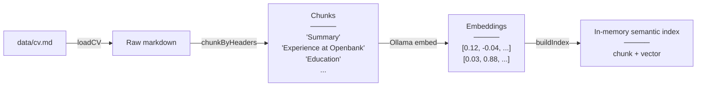
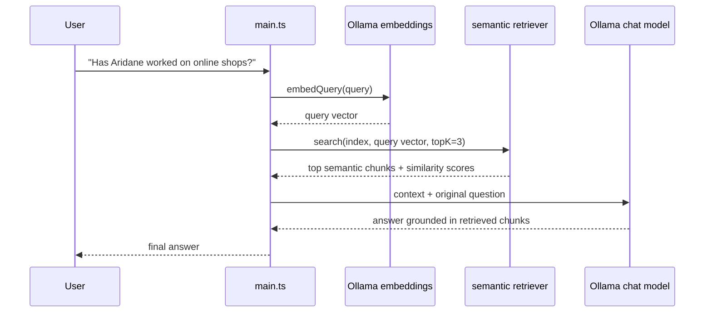

# RAG-04 — Local Semantic Search with Ollama Embeddings

## Project learnings

By the end of this module you should understand:

- What embeddings are at a practical level: vectors that represent text meaning.
- How local Ollama embeddings can power semantic retrieval without a paid API.
- How cosine similarity ranks chunks by vector direction instead of exact words.
- Why semantic search can find related wording that BM25 may miss.
- Why an in-memory vector index is great for learning but not enough for larger systems.

## Viewing diagrams

This README uses Mermaid diagrams. GitHub renders them automatically. If you read this in VS Code or another editor, install a Mermaid preview extension, such as **Markdown Preview Mermaid Support**, to view the diagrams properly.

## What this demo shows

RAG-04 replaces BM25 keyword retrieval with **semantic retrieval**.

The CV still lives in `data/cv.md`, and the app still retrieves relevant chunks before answering. The difference is how retrieval works:

- RAG-02 and RAG-03 searched for exact word overlap with BM25.
- RAG-04 turns each chunk into an **embedding**: an array of numbers that represents meaning.
- At question time, the user question is embedded too.
- The app compares the question vector against every chunk vector using **cosine similarity**.

This lets the retriever match related ideas even when the words are different.

Example:

```text
Question: "Has Aridane worked on online shops?"
Chunk:    "Built the e-commerce frontend for several countries."
```

BM25 may struggle because "online shops" and "e-commerce" are different words. Semantic search can still rank the chunk highly because the ideas are close.

## Two phases

### Phase 1 — Startup: load, chunk, embed, index



The embedding step runs locally through Ollama. No OpenAI key, hosted vector database, or paid service is required.

### Phase 2 — Per query: embed, retrieve, answer



RAG-04 intentionally sends the original user question directly to the embedding model. This keeps the module focused on vectors:

```text
RAG-03: question rewriting + BM25 keyword search
RAG-04: original question -> local embedding -> semantic search
```

## What an embedding is

An embedding is a vector:

```ts
[0.021, -0.182, 0.449, ...]
```

You should not read individual numbers as features. The useful property is geometric:

- Similar texts point in similar directions.
- Unrelated texts point in different directions.
- Cosine similarity measures how aligned two vectors are.

The formula:

```text
cosineSimilarity(a, b) = dot(a, b) / (length(a) * length(b))
```

In this demo, higher scores mean "the question and this chunk are semantically closer."

## File structure

```text
data/
  cv.md                    <- same source document as RAG-02/RAG-03
src/
  main.ts                  <- embed query -> semantic search -> answer
  prompts.ts               <- final answer prompt template
  setup.ts                 <- buildChatModel + buildEmbeddingModel + buildRagIndex
  chains/
    answer.ts              <- final grounded answer chain
  rag/
    loader.ts              <- reads data/cv.md
    chunker.ts             <- splits markdown into chunks
    embeddings.ts          <- local Ollama embedding adapter
    semantic-retriever.ts  <- cosine similarity + in-memory vector index
    semantic-retriever.test.ts
  internal/
    ui/output.ts           <- terminal output helpers
```

## How to start

See [`HOW_TO_START.md`](./HOW_TO_START.md) for setup, Ollama model pulls, and run commands.

## What you see in the terminal

```text
[embedding] Query embedded into 768 dimensions.
[rag] Retrieved 3 chunk(s): "Experience at Douglas" (0.712), "Experience at Openbank" (0.533)
```

The score beside each chunk is the cosine similarity between the query embedding and the chunk embedding.

## Why this is still not production RAG

This module intentionally keeps the vector index in memory. That is perfect for learning because all the moving parts are visible, but it has limits:

| | Works well | Breaks |
|---|---|---|
| **Data size** | Small documents | Large collections |
| **Startup** | Fast enough for demos | Expensive if every boot re-embeds everything |
| **Persistence** | None needed | Embeddings are lost when the app stops |
| **Search** | Simple cosine scan | Slow when there are many chunks |

That is what the next module should solve with Supabase + pgvector.
