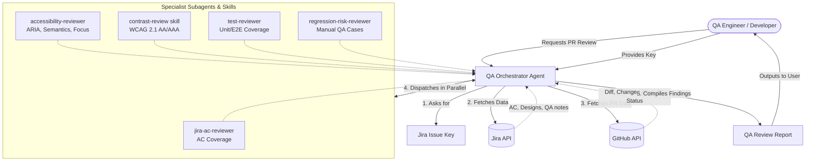

# Frontend QA AI Harness

This repository contains a specialized AI harness designed for QA engineers in a Frontend project. It configures AI assistants (Claude, Gemini, etc.) to perform automated, read-only QA reviews of GitHub Pull Requests against Jira acceptance criteria, accessibility standards, and UI/UX best practices.

## Overview

The harness enforces strict rules to prevent unauthorized modifications or destructive commands, ensuring the AI acts purely as an analytical QA reviewer.

The setup consists of an Orchestrator Agent that delegates tasks to specialist subagents and skills in parallel.

## Architecture

Below is a visual representation of how the QA Harness operates during a PR review:

## Review Categories

The resulting **QA Review Report** summarizes findings into the following structured categories:

- **Bugs / Blocking Issues**: Critical defects that prevent the PR from being merged.
- **UI/UX & Non-blocking Issues**: Visual discrepancies, UX feedback, and minor defects.
- **Accessibility Findings**: Issues regarding semantic HTML, keyboard navigation, focus, and color contrast.
- **Test Coverage Findings**: Missing unit, component, or integration tests.
- **Manual QA Scenarios**: Suggested test paths for human validation.
- **Suggested GitHub PR Comments**: Pre-drafted, actionable comments for the PR author.

## Setup & Rules

- AI assistants are instructed to **never** edit files unless explicitly asked for an implementation task.
- Read-only bash commands (`git status`, `gh pr view`, `curl`, etc.) are allowed.
- Destructive commands (`git push`, `rm`, deploy) are strictly forbidden.

## Usage

When initiating the AI, simply ask it to review a PR for QA issues. The orchestrator will automatically prompt you for the required Jira Issue key to begin its comprehensive analysis.
