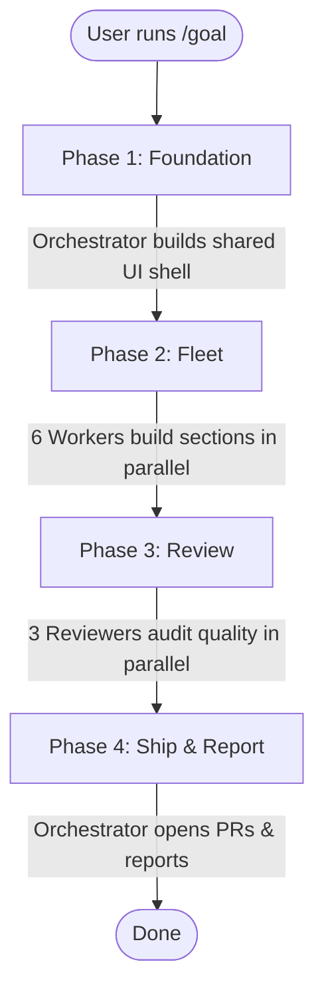

# Harness Example

This is a Next.js 15 (App Router) project bootstrapped for the AI-assisted development course. 
It serves as a harness for an autonomous fleet demo.

## Demo Workflow

The harness executes the following autonomous steps when a goal is submitted:



### Agents & Phases Breakdown

| Phase | Active Agent(s) | Responsibilities |
|---|---|---|
| **1. Foundation** | **Orchestrator** | Sequentially generates design tokens, UI primitives (`Heading`, `Button`, `Card`, `Section`), the app shell, and stubs for all 6 sections. Commits directly to `main`. |
| **2. Fleet** | **6x `section-worker`** | Dispatched concurrently in isolated git worktrees. Each agent takes ownership of a single section and builds it following a strict Red → Green → Refactor TDD cycle. |
| **3. Review** | **`react-reviewer`**<br/>**`accessibility-reviewer`**<br/>**`4r-reviewer`** | Dispatched concurrently to read across all 6 section worktrees (without modifying code). They emit verdicts based on React patterns, a11y standards, and the 4R framework (Risk, Readability, Reliability, Resilience). |
| **4. Ship & Report** | **Orchestrator** | Collects the results, opens GitHub PRs for the sections that successfully passed all tests and reviews, and prints a final **6×4 quality check matrix** to the user (detailing the Build, React, Accessibility, and 4R Review status for all 6 page sections). |

### The 4R Framework

During Phase 3, the `4r-reviewer` subagent audits the codebase against four strict quality gates. The agent checks for objective, verifiable signals rather than subjective opinions:

1. **Risk:** Ensures no security vulnerabilities or production-breaking changes are introduced. The agent checks for things like missing sanitization (`dangerouslySetInnerHTML`), untrusted URL props, unprotected server actions, and runtime scripts lacking integrity checks.
2. **Readability:** Ensures the code is understandable and respects complexity budgets. The agent enforces rules like component length (<200 LOC), shallow JSX nesting (≤4 levels), no magic numbers, explicit types (no `any`), and strict prop limits.
3. **Reliability:** Ensures the code is genuinely tested with useful coverage. The agent verifies that colocated tests exist, tests assert user-visible behavior (rather than implementation details), explicit edge cases are covered, and logic snapshots are avoided.
4. **Resilience:** Ensures the application degrades gracefully when failures occur. The agent looks for proper React Error Boundaries (`error.tsx`), loading states (`loading.tsx` or Suspense), fallbacks for failed server fetches, and proper error telemetry rather than swallowed exceptions.

## Getting Started

First, run the development server:

```bash
npm run dev
```

Open [http://localhost:3000](http://localhost:3000) with your browser to see the result.

## Scripts

- `npm run dev`: Starts the development server.
- `npm run build`: Builds the app for production.
- `npm run start`: Runs the built app in production mode.
- `npm run lint`: Runs ESLint.
- `npm run typecheck`: Runs TypeScript compiler check.
- `npm run test`: Runs tests using Vitest.
