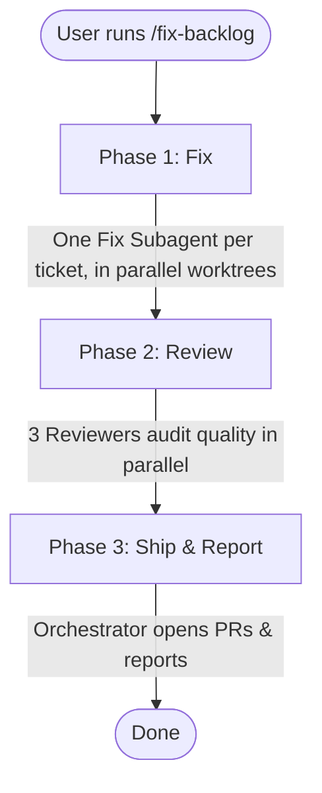

# Harness Example

This is a Next.js 15 (App Router) project bootstrapped for the AI-assisted development course.
It serves as a harness for a parallel subagent-delegation demo: a small backlog of real, independent bugs gets fixed by one subagent per ticket, isolated in its own git worktree.

## Demo Workflow

The harness executes the following autonomous steps when `/fix-backlog` is run:



### Agents & Phases Breakdown

| Phase | Active Agent(s) | Responsibilities |
|---|---|---|
| **1. Fix** | **5x `ticket-fixer`** | Dispatched concurrently, each in a git worktree the Orchestrator creates for it. Each agent takes ownership of one ticket from `docs/backlog.md` and fixes it following a strict Red → Green → Refactor TDD cycle. Two tickets (B1, B5) deliberately share a file to show that isolation comes from the worktree, not from exclusive file ownership. |
| **2. Review** | **`react-reviewer`**<br/>**`accessibility-reviewer`**<br/>**`4r-reviewer`** | Dispatched concurrently to read across all fixed worktrees (without modifying code). They emit verdicts based on React patterns, a11y standards, and the 4R framework (Risk, Readability, Reliability, Resilience). |
| **3. Ship & Report** | **Orchestrator** | Collects the results, opens GitHub PRs for the tickets that successfully passed all tests and reviews, and prints a final quality-check matrix to the user (Ticket × Fix/React/a11y/4R status). |

### The 4R Framework

During Phase 2, the `4r-reviewer` subagent audits each fix against four strict quality gates. The agent checks for objective, verifiable signals rather than subjective opinions:

1. **Risk:** Ensures no security vulnerabilities or production-breaking changes are introduced, and that the fix stayed inside its own ticket's file.
2. **Readability:** Ensures the code is understandable and respects complexity budgets — component length, shallow JSX nesting, no magic numbers, explicit types (no `any`), and strict prop limits.
3. **Reliability:** Ensures the code is genuinely tested with useful coverage — colocated tests exist, tests assert user-visible behavior (rather than implementation details), and the ticket's specific bug is actually covered by an assertion.
4. **Resilience:** Ensures the component degrades gracefully on edge-case input (e.g. an empty list renders a fallback, not a crash) rather than throwing.

## Getting Started

First, run the development server:

```bash
npm run dev
```

Open [http://localhost:3000](http://localhost:3000) with your browser to see the result.

## Scripts

- `npm run dev`: Starts the development server.
- `npm run build`: Builds the app for production.
- `npm run start`: Runs the built app in production mode.
- `npm run lint`: Runs ESLint.
- `npm run typecheck`: Runs TypeScript compiler check.
- `npm run test`: Runs tests using Vitest.
